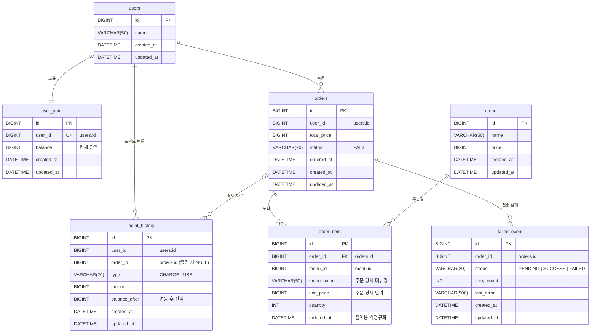

# ☕ Coffee Order System

포인트로 커피를 주문·결제하고, 주문 내역을 외부 데이터 수집 플랫폼으로 **실시간 전송**하는 커피 주문 시스템입니다.
여러 대의 서버에서 동시에 요청이 들어와도 포인트 잔액이 꼬이지 않도록 **Redis 분산 락**으로 동시성을 제어하고,
외부 플랫폼 장애가 주문에 영향을 주지 않도록 **트랜잭션 커밋 이후 비동기 전송 + 실패 건 재전송** 구조로 설계했습니다.

## 목차
- [주요 기능](#-주요-기능)
- [기술 스택](#-기술-스택)
- [실행 방법](#-실행-방법)
- [API 명세](#-api-명세)
- [ERD](#-erd)
- [패키지 구조](#-패키지-구조)
- [핵심 설계](#-핵심-설계)
- [트러블슈팅](#-트러블슈팅)

---

## ✨ 주요 기능

| 기능 | 설명 |
|---|---|
| 메뉴 목록 조회 | 전체 커피 메뉴의 ID, 이름, 가격 조회 |
| 포인트 충전 | 사용자 포인트 충전 (1회 최대 1,000,000P, 보유 한도 10,000,000P) |
| 커피 주문/결제 | 여러 메뉴를 한 번에 주문하고 포인트로 결제 |
| 인기 메뉴 조회 | 최근 7일간 가장 많이 주문된 메뉴 TOP 3 |
| 주문 내역 실시간 전송 | 결제가 완료된 주문을 외부 수집 플랫폼으로 비동기 전송, 실패 시 자동 재전송 |

---

## 🛠 기술 스택

| 구분 | 기술 |
|---|---|
| Language | Java 17 |
| Framework | Spring Boot 4.1.1, Spring Data JPA, Spring Validation |
| Database | MySQL 8.4 |
| Cache / Lock | Redis 7.4, Redisson 4.7.0 (분산 락) |
| HTTP Client | Spring RestClient |
| Infra | Docker Compose |
| Test | JUnit 5, H2, WireMock, embedded-redis |

---

## 🚀 실행 방법

### 1. 사전 준비
- JDK 17
- Docker Desktop

### 2. MySQL, Redis 실행
```bash
docker compose up -d
```

| 서비스 | 포트 | 계정 |
|---|---|---|
| MySQL | 3306 | DB `cafe` / user `cafe` / password `cafe` |
| Redis | 6379 | - |

> Spring Boot의 Docker Compose 지원(`spring-boot-docker-compose`)이 포함되어 있어, Docker Desktop만 켜져 있으면 애플리케이션 실행 시 컨테이너가 자동으로 함께 실행됩니다.

### 3. 애플리케이션 실행
```bash
./gradlew bootRun
```

기본 프로필은 `local`이며, 첫 실행 시 `LocalDataInitializer`가 아래 테스트 데이터를 자동으로 생성합니다.

| 메뉴 ID | 이름 | 가격 |
|---|---|---|
| 1 | 아메리카노 | 4,500 |
| 2 | 카페라떼 | 5,000 |
| 3 | 바닐라라떼 | 5,500 |
| 4 | 콜드브루 | 5,000 |
| 5 | 카푸치노 | 5,000 |

- 사용자: `user1`, `user2`, `user3` (ID 1~3), 각 사용자의 포인트 계정(잔액 0P)

### ⚠️ 주의사항
- `Access denied for user 'cafe'@'localhost'` 오류가 발생하면, 로컬에 직접 설치된 MySQL이 3306 포트를 사용하고 있는지 확인하세요. 로컬 MySQL을 종료하거나 `compose.yaml`의 포트를 변경해야 합니다.

### 설정 (`application.yaml`)
```yaml
data-platform:
  base-url: http://localhost:8089   # 외부 수집 플랫폼 주소
  connect-timeout: 1s
  read-timeout: 3s
  retry:
    enabled: true        # 실패 건 재전송 스케줄러 사용 여부
    fixed-delay: 60000   # 재전송 주기 (ms)
    max-count: 5         # 최대 재시도 횟수
    batch-size: 100      # 한 번에 재전송할 최대 건수
```

---

## 📖 API 명세

### 공통 에러 응답
모든 에러는 아래 형식으로 응답합니다.
```json
{
  "code": "INSUFFICIENT_POINT",
  "message": "포인트가 부족합니다."
}
```

| code | HTTP | 메시지 |
|---|---|---|
| `INVALID_REQUEST` | 400 | 요청 값이 올바르지 않습니다. |
| `DUPLICATE_MENU_IN_ORDER` | 400 | 한 주문에 같은 메뉴를 중복으로 담을 수 없습니다. |
| `INSUFFICIENT_POINT` | 400 | 포인트가 부족합니다. |
| `POINT_LIMIT_EXCEEDED` | 400 | 보유 가능한 최대 포인트를 초과합니다. |
| `USER_NOT_FOUND` | 404 | 사용자를 찾을 수 없습니다. |
| `MENU_NOT_FOUND` | 404 | 메뉴를 찾을 수 없습니다. |
| `CONCURRENT_REQUEST` | 409 | 같은 사용자의 다른 요청을 처리 중입니다. 잠시 후 다시 시도해 주세요. |
| `INTERNAL_ERROR` | 500 | 서버 내부 오류가 발생했습니다. |

> 입력값 검증(`@Valid`)에 실패하면 `INVALID_REQUEST` 코드와 함께 `"필드명: 검증 메시지"` 형식의 메시지를 응답합니다.

---

### 1. 메뉴 목록 조회
```
GET /api/menus
```

**Response** `200 OK`
```json
[
  { "menuId": 1, "name": "아메리카노", "price": 4500 },
  { "menuId": 2, "name": "카페라떼", "price": 5000 },
  { "menuId": 3, "name": "바닐라라떼", "price": 5500 },
  { "menuId": 4, "name": "콜드브루", "price": 5000 },
  { "menuId": 5, "name": "카푸치노", "price": 5000 }
]
```

---

### 2. 포인트 충전
```
POST /api/user/{userId}/points/charge
```

**Request**
```json
{
  "amount": 50000
}
```

| 필드 | 타입 | 필수 | 규칙 |
|---|---|---|---|
| `amount` | Long | O | 1 ~ 1,000,000 |

**Response** `200 OK`
```json
{
  "userId": 1,
  "chargedAmount": 50000,
  "balance": 50000
}
```

**Error**

| 상황 | code |
|---|---|
| 존재하지 않는 사용자 | `USER_NOT_FOUND` |
| 충전 금액이 범위를 벗어남 | `INVALID_REQUEST` |
| 충전 후 잔액이 10,000,000P 초과 | `POINT_LIMIT_EXCEEDED` |
| 같은 사용자의 요청이 처리 중 (락 대기 3초 초과) | `CONCURRENT_REQUEST` |

```json
{
  "code": "INVALID_REQUEST",
  "message": "amount: 충전 금액은 1P 이상이어야 합니다."
}
```

---

### 3. 커피 주문/결제
```
POST /api/orders
```

**Request**
```json
{
  "userId": 1,
  "items": [
    { "menuId": 1, "quantity": 2 },
    { "menuId": 3, "quantity": 1 }
  ]
}
```

| 필드 | 타입 | 필수 | 규칙 |
|---|---|---|---|
| `userId` | Long | O | |
| `items` | Array | O | 1 ~ 20개, 같은 메뉴 중복 불가 |
| `items[].menuId` | Long | O | |
| `items[].quantity` | Integer | O | 1 ~ 100 |

**Response** `201 Created`
```json
{
  "orderId": 1,
  "totalPrice": 14500,
  "remainingPoint": 35500,
  "orderedAt": "2026-10-07T12:30:15",
  "items": [
    { "menuId": 1, "name": "아메리카노", "unitPrice": 4500, "quantity": 2 },
    { "menuId": 3, "name": "바닐라라떼", "unitPrice": 5500, "quantity": 1 }
  ]
}
```

**Error**

| 상황 | code |
|---|---|
| 존재하지 않는 사용자 | `USER_NOT_FOUND` |
| 존재하지 않는 메뉴 포함 | `MENU_NOT_FOUND` |
| 같은 메뉴를 중복으로 담음 | `DUPLICATE_MENU_IN_ORDER` |
| 포인트 잔액 부족 | `INSUFFICIENT_POINT` |
| 항목 수, 수량 등 입력값 오류 | `INVALID_REQUEST` |
| 같은 사용자의 요청이 처리 중 | `CONCURRENT_REQUEST` |

```json
{
  "code": "INVALID_REQUEST",
  "message": "items[0].quantity: 수량은 1개 이상이어야 합니다."
}
```

---

### 4. 인기 메뉴 조회
```
GET /api/menus/popular
```

- 집계 기간: **오늘을 포함한 최근 7일** (6일 전 00:00 ~ 내일 00:00, Asia/Seoul 기준)
- 집계 기준: 메뉴가 포함된 **주문 건수** (수량 합계가 아님)
- 주문 건수가 같으면 메뉴 ID가 작은 순서로 정렬, 최대 3개

**Response** `200 OK`
```json
[
  { "rank": 1, "menuId": 1, "name": "아메리카노", "price": 4500, "orderCount": 12 },
  { "rank": 2, "menuId": 3, "name": "바닐라라떼", "price": 5500, "orderCount": 8 },
  { "rank": 3, "menuId": 4, "name": "콜드브루", "price": 5000, "orderCount": 8 }
]
```
> 주문 내역이 없으면 빈 배열 `[]`을 응답합니다.

---

### 5. (외부 연동) 주문 내역 수집 플랫폼 전송
주문이 완료되면 서버가 외부 수집 플랫폼으로 아래 요청을 보냅니다. 클라이언트가 직접 호출하는 API는 아닙니다.
```
POST {data-platform.base-url}/collect/orders
```
```json
{
  "orderId": 1,
  "userId": 1,
  "totalPrice": 14500,
  "items": [
    { "menuId": 1, "quantity": 2, "amount": 9000 },
    { "menuId": 3, "quantity": 1, "amount": 5500 }
  ]
}
```

---

## 🗂 ERD


<details>
<summary>Mermaid 코드로 보기</summary>



</details>

### 연관관계 매핑

| 관계 | 카디널리티 | 매핑 방식 | 설명 |
|---|---|---|---|
| `orders` - `order_item` | 1 : N | **JPA 양방향 연관관계** | `Order.orderItems`(`@OneToMany(mappedBy, cascade = ALL, orphanRemoval = true)`) ↔ `OrderItem.order`(`@ManyToOne(LAZY)`). 주문과 주문 항목은 항상 함께 생성되는 하나의 단위(Aggregate)이므로 `Order`가 생명주기를 관리 |
| `users` - `user_point` | 1 : 1 | ID 참조 (`user_id` UNIQUE) | 사용자당 포인트 계정은 하나 |
| `users` - `point_history` | 1 : N | ID 참조 | 충전·사용 내역 |
| `users` - `orders` | 1 : N | ID 참조 | |
| `menu` - `order_item` | 1 : N | ID 참조 + 스냅샷 | 메뉴명·단가를 주문 시점 값으로 복사해 저장 |
| `orders` - `point_history` | 1 : 0..N | ID 참조 (nullable) | 결제(USE) 내역에만 주문 ID 저장, 충전(CHARGE)은 NULL |
| `orders` - `failed_event` | 1 : 0..N | ID 참조 | 전송에 실패한 주문만 기록 |

**왜 `Order`-`OrderItem`만 JPA 연관관계로 매핑했나요?**
- `Order`와 `OrderItem`은 함께 저장·조회되는 **하나의 Aggregate**라서 객체 참조로 묶었습니다.
- 그 외의 관계(사용자, 메뉴, 포인트, 실패 이벤트)는 **서로 다른 도메인**이라 ID로만 참조합니다. 도메인 간 결합도를 낮추고, 불필요한 지연 로딩·N+1 문제와 트랜잭션 경계가 얽히는 것을 피할 수 있습니다.

### 인덱스 / 제약조건

| 테이블 | 이름 | 컬럼 | 용도 |
|---|---|---|---|
| `user_point` | `uk_user_point_user` (UNIQUE) | `user_id` | 사용자당 포인트 계정 1개 보장 |
| `order_item` | `uk_order_item_order_menu` (UNIQUE) | `order_id, menu_id` | 한 주문 내 메뉴 중복 방지 |
| `order_item` | `idx_order_item_ordered_at_menu` | `ordered_at, menu_id` | 인기 메뉴 기간 집계 |
| `point_history` | `idx_point_history_user_created` | `user_id, created_at` | 사용자별 포인트 내역 조회 |
| `failed_event` | `idx_failed_event_status_created` | `status, created_at` | 재전송 대상(PENDING) 조회 |

---

## 📁 패키지 구조

```
com.coffeeordersystem
├── global          # 공통 (예외 처리, 분산 락, JPA Auditing, Clock 설정)
│   ├── config
│   ├── entity
│   ├── exception
│   └── lock
├── user            # 사용자
├── menu            # 메뉴 조회
├── point           # 포인트 충전/사용, 포인트 내역
├── order           # 주문/결제, 주문 완료 이벤트
├── ranking         # 인기 메뉴 집계
├── dataplatform    # 외부 수집 플랫폼 전송, 실패 건 재전송
│   ├── client
│   ├── config
│   ├── domain
│   ├── listener
│   ├── repository
│   ├── scheduler
│   └── service
└── init            # local 프로필 초기 데이터
```

각 도메인은 `controller → facade → service → repository` 계층으로 구성됩니다.
`facade`는 **분산 락**과 **락 밖에서 처리할 수 있는 검증**을 담당하고, `service`는 **트랜잭션 안의 비즈니스 로직**을 담당합니다.

---

## 💡 핵심 설계

### 1. 분산 락으로 포인트 동시성 제어
**문제** 같은 사용자가 동시에 충전·주문하면 잔액을 읽고 쓰는 사이에 다른 요청이 끼어들어 잔액이 틀어질 수 있습니다(Lost Update). 서버가 여러 대이면 `synchronized`로는 막을 수 없습니다.

**해결** Redisson 분산 락(`lock:point:{userId}`)으로 **같은 사용자의 포인트 변경 요청을 한 번에 하나씩** 처리합니다. 포인트 충전과 주문 결제가 **같은 락 키**를 사용하므로 충전과 결제가 동시에 실행되지 않습니다. 락을 3초 안에 얻지 못하면 `409 CONCURRENT_REQUEST`로 응답합니다.

### 2. 락 → 트랜잭션 순서 보장 (Facade 패턴)
```
Facade: [검증] → [락 획득] → Service: [트랜잭션 시작 → 커밋] → [락 해제]
```
- 트랜잭션 안에서 락을 잡으면, **커밋되기 전에 락이 먼저 풀려** 다음 요청이 커밋 전의 잔액을 읽을 수 있습니다.
- 그래서 락은 `Facade`에서 잡고, 트랜잭션은 그 안의 `Service`에서 시작해 **커밋이 끝난 뒤 락이 해제**되도록 했습니다.
- 사용자·메뉴 존재 여부와 가격 계산(`OrderValidator`)은 락 밖에서 처리해 **락을 잡고 있는 시간을 최소화**했습니다.

### 3. 커밋 이후 비동기 전송
**문제** 주문 트랜잭션 안에서 외부 플랫폼을 호출하면 외부 장애가 주문 실패로 이어지고, 응답 시간도 외부 시스템에 묶입니다. 반대로 주문이 롤백됐는데 전송은 이미 된 상황도 생길 수 있습니다.

**해결**
- `@TransactionalEventListener(phase = AFTER_COMMIT)`: **결제가 확정(커밋)된 주문만** 전송합니다.
- 전송은 전용 스레드 풀(`dataPlatformExecutor`, core 4 / max 8 / queue 500)에 맡기고 즉시 반환하므로, **주문 응답 속도가 외부 시스템과 무관**합니다.
- 연결 타임아웃 1초, 응답 타임아웃 3초로 외부 장애 시 스레드가 오래 묶이지 않게 했습니다.

### 4. 실패 건 저장 + 재전송 스케줄러
- 전송 실패, 타임아웃, 스레드 풀 큐 초과 시 `failed_event`에 `PENDING`으로 기록합니다.
- 실패 기록은 `REQUIRES_NEW` 트랜잭션으로 저장해 호출하는 쪽의 트랜잭션 상태와 관계없이 남도록 했습니다.
- `FailedEventRetryScheduler`가 1분마다 `PENDING` 건을 오래된 순으로 최대 100건씩 재전송합니다. 성공하면 `SUCCESS`, 5회 실패하면 `FAILED`로 바꿔 무한 재시도를 막습니다.
- 서버가 여러 대여도 **락을 잡은 한 서버만** 재전송하도록 해 중복 전송을 막았습니다.
- 재전송할 데이터는 따로 저장하지 않고 **주문 원본에서 다시 만들어** 데이터 불일치를 막았습니다.

### 5. 주문 당시 정보 보존 (스냅샷)
`order_item`에 메뉴명·단가를 복사해 저장합니다. 나중에 메뉴 가격이나 이름이 바뀌어도 **과거 주문 내역과 결제 금액은 변하지 않습니다.**

### 6. 인기 메뉴 집계 최적화
- `orders`의 주문 시각을 `order_item.ordered_at`에도 함께 저장(역정규화)해 **조인 없이** 기간 집계를 합니다.
- `(ordered_at, menu_id)` 복합 인덱스로 기간 조건과 그룹핑을 처리합니다.
- 집계 쿼리는 메뉴 ID와 주문 수만 가져오고, 메뉴 정보는 `findAllById`로 **한 번에 조회**해 N+1 문제를 피했습니다.
- 현재 시각은 주입받은 `Clock`(Asia/Seoul)으로 계산해 테스트에서 시간을 고정할 수 있게 했습니다.

### 7. 포인트 내역으로 변동 이력 추적
모든 충전·사용을 `point_history`에 **변동 후 잔액(`balance_after`)과 함께** 기록해, 잔액이 어떻게 변해 왔는지 추적할 수 있습니다.
